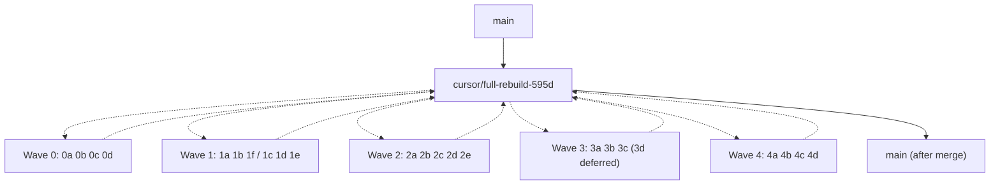

# Stages 0–4 — Completion Report

**Branch:** `cursor/full-rebuild-595d`
**Epic PR:** [#6](https://github.com/exotiq-ai/lead-gen-saul/pull/6)
**Scope:** REVIEW_AND_ROADMAP.md Stages 0a → 4d
**Deferred:** Stage 3d (Multi-tenant SSO — needs identity-provider decision)

This branch ships everything in the roadmap except SSO. It is a draft PR — flip to ready-for-review after the items in §5 below are confirmed.

## 1. What landed

23 child PRs merged into the epic across 5 waves, plus this report. Each child branch + PR is preserved on origin so individual items can be reviewed or reverted.

| Stage | PR | Title | Files touched |
| --- | --- | --- | --- |
| 0a | [#2](https://github.com/exotiq-ai/lead-gen-saul/pull/2) | Fix leads page response shape + add stats aggregates | `src/app/api/leads/route.ts`, `src/hooks/useLeads.ts` |
| 0b | [#3](https://github.com/exotiq-ai/lead-gen-saul/pull/3) | KPI sparklines now reflect real signal | `src/app/api/dashboard/kpis/route.ts` |
| 0c | [#4](https://github.com/exotiq-ai/lead-gen-saul/pull/4) | Tenant-filter pipeline_stages, drop dead column ref | `src/app/api/dashboard/pipeline/route.ts` |
| 0d | [#5](https://github.com/exotiq-ai/lead-gen-saul/pull/5) | discover.py syntax fix + Python pre-push + CI | `python-agent/skills/discover.py`, `.githooks/pre-push`, `.github/workflows/ci.yml`, `.gitignore` |
| 1a | [#7](https://github.com/exotiq-ai/lead-gen-saul/pull/7) | Drop phantom city/state/tags/metadata from leads insert | `src/app/api/leads/route.ts`, `src/components/leads/LeadRow.tsx` |
| 1b | [#8](https://github.com/exotiq-ai/lead-gen-saul/pull/8) | GHL outbound send (dry-run gated) | `src/lib/ghl/outbound.ts`, `src/app/api/outreach/queue/[id]/route.ts`, `README.md` |
| 1c | [#10](https://github.com/exotiq-ai/lead-gen-saul/pull/10) | Tenant-aware RLS via `set_request_tenant()` | `supabase/migrations/009_tenant_views_and_grants.sql` |
| 1d | [#11](https://github.com/exotiq-ai/lead-gen-saul/pull/11) | Score backfill + composite-missing pickup | `scripts/backfill_scores.ts`, `python-agent/skills/score.py`, `package.json` |
| 1e | [#12](https://github.com/exotiq-ai/lead-gen-saul/pull/12) | Kill 6 lint errors | 5 page-clients + 2 chart files |
| 1f | [#9](https://github.com/exotiq-ai/lead-gen-saul/pull/9) | Consolidate dashboard store | `src/lib/store/dashboardStore.ts` deleted |
| 2a | [#13](https://github.com/exotiq-ai/lead-gen-saul/pull/13) | DB-backed outreach templates with editor UI | new migration 010, `/api/outreach/templates`, `/dashboard/outreach/templates`, `python-agent/skills/draft.py` |
| 2b | [#14](https://github.com/exotiq-ai/lead-gen-saul/pull/14) | Bulk approve/reject from queue | `/api/outreach/queue/bulk`, `OutreachPageClient`, `ApprovalCard` |
| 2c | [#15](https://github.com/exotiq-ai/lead-gen-saul/pull/15) | Central exports + streaming CSV API | `/api/exports`, `/dashboard/exports`, `src/lib/utils/csv.ts` |
| 2d | [#16](https://github.com/exotiq-ai/lead-gen-saul/pull/16) | Activity-driven re-scoring | `python-agent/skills/score.py` |
| 2e | [#17](https://github.com/exotiq-ai/lead-gen-saul/pull/17) | Honest agent dashboard status | `src/app/api/dashboard/agents/route.ts`, `AgentsPageClient` |
| 3a | [#18](https://github.com/exotiq-ai/lead-gen-saul/pull/18) | DB-driven tenant catalog | `/api/tenants`, `useTenant.ts`, `TenantSelector`, `TenantGuard` |
| 3b | [#19](https://github.com/exotiq-ai/lead-gen-saul/pull/19) | Pipeline stage editor + reorder API | `/api/pipeline/stages`, `SettingsPageClient` |
| 3c | [#20](https://github.com/exotiq-ai/lead-gen-saul/pull/20) | Real cost attribution | `python-agent/costs.py`, `main.py`, all 6 skills |
| 4a | [#21](https://github.com/exotiq-ai/lead-gen-saul/pull/21) | Playwright e2e harness | new `e2e/`, `playwright.config.ts`, CI job |
| 4b | [#22](https://github.com/exotiq-ai/lead-gen-saul/pull/22) | Split LeadDetailClient into lazy subcomponents | 4 new files under `src/components/leads/detail/`, `LeadDetailClient.tsx` 998 → 147 lines |
| 4c | [#23](https://github.com/exotiq-ai/lead-gen-saul/pull/23) | Live SSE stream of agent_runs | `/api/dashboard/agents/stream`, `AgentsPageClient` |
| 4d | [#24](https://github.com/exotiq-ai/lead-gen-saul/pull/24) | Mobile padding polish + e2e mobile project | 5 page clients, `playwright.config.ts` |

## 2. Verification — final epic head

| Check | Result |
| --- | --- |
| `npm run typecheck` | clean |
| `npm run build` | clean (33 pages, 16 dynamic API routes) |
| `npm run lint` | 0 errors, 31 pre-existing warnings (unused vars in seed/scoring scripts) |
| `python3 -m py_compile python-agent/**/*.py` | clean |
| `npx playwright test --list` | 10 tests (5 desktop, 5 mobile) |

## 3. What this branch fixes that's still broken on `main`

Confirmed live on https://saul-lead.netlify.app while writing this report:

| Bug | Live before (main) | After (epic) |
| --- | --- | --- |
| Leads page renders empty | `/api/leads` returns `{leads, total, …}`; client reads `data.data` / `data.meta`. | API returns both `{data, meta}` and legacy keys; aggregates added. Client matches. |
| Pipeline funnel always `{"stages":[]}` | `pipeline_stages` SELECT not tenant-filtered. | `eq('tenant_id', tenantId)` added. Dead `ghl_pipeline_stage_id` reference removed. |
| KPI sparklines `[0,0,0,0,0,0,0]` for active + velocity | Both keyed on `created_at` 7-day bucket; stable population always zero. | Active = running daily count of non-lost/non-disqualified. Velocity = 24h-window creation. Score / conversion buckets cleaned up. |
| Python orchestrator never starts | `discover.py:88` was `seen_domains: = set()` (`SyntaxError`); main.py imports it. | Type annotation fixed. Pre-push hook + CI workflow gate against re-introduction. |

## 4. What needs human action before this epic merges to `main`

These are the manual steps that the autonomous run can't do:

1. **Apply two new Supabase migrations** (idempotent, safe to re-run):
   - `supabase/migrations/009_tenant_views_and_grants.sql` — tenant-aware RLS
   - `supabase/migrations/010_outreach_templates_seed.sql` — seed editable templates

   Either via `psql "$DATABASE_URL" -f …` or paste into the Supabase SQL editor.

2. **Add Cloud Agent secrets** (Cursor Dashboard → Cloud Agents → Secrets) so the new code lights up:
   - `SUPABASE_SERVICE_ROLE_KEY` — required for `npm run backfill-scores`
   - `GHL_API_KEY` + `GHL_LOCATION_ID` — required to actually send via GHL when `GHL_OUTBOUND_DRY_RUN=false`. Until set, "Mark sent (GHL)" runs in dry-run mode and logs to console.
   - `GHL_MEDSPA_API_KEY` + `GHL_MEDSPA_LOCATION_ID` — same, for the MedSpa sub-account.
   - `GOOGLE_PLACES_API_KEY` — already in env; new cost attribution surfaces it.
   - `APOLLO_API_KEY` — already in env; new cost attribution surfaces it.

3. **Run `npm run backfill-scores --once-after-migrations-applied`** to fix the step-function score distribution (Stage 1d). Defaults to 10 leads/sec, ~70 seconds for the current ~700 lead population.

4. **Pick an SSO identity provider** (Stage 3d, deferred) — Supabase magic-link / Google / GitHub / Clerk. Once chosen I can ship that as a follow-up plan.

## 5. Risk + rollback

- **Per-PR revert:** every wave has child PRs preserved on origin. To roll back any item in isolation, revert its merge commit on the epic and re-push.
- **Roll back the entire epic:** `git revert -m 1 <epic-merge-into-main>` once it's merged. All child PR branches stay intact.
- **`GHL_OUTBOUND_DRY_RUN=true` is the default**, so 1b cannot accidentally send messages before secrets are configured. Keep it default-true in the production env until you're ready to flip it.

## 6. Outstanding follow-ups (out of scope for this epic)

- **Stage 3d SSO** — needs a 1-question conversation about identity provider before I touch Supabase Auth.
- **Stage 1d backfill execution** — the script is shipped but I can't run it from this VM without `SUPABASE_SERVICE_ROLE_KEY`. Documented in §4 above.
- **31 pre-existing lint warnings** — mostly unused vars in scoring/seed scripts. Can be cleaned in a Phase-2-Polish PR.
- **Real e2e against a test Supabase project** — current Playwright suite mocks at the network layer. Adding `supabase start` in CI would give true end-to-end coverage but requires Docker on the runner.

## 7. Branch graph

